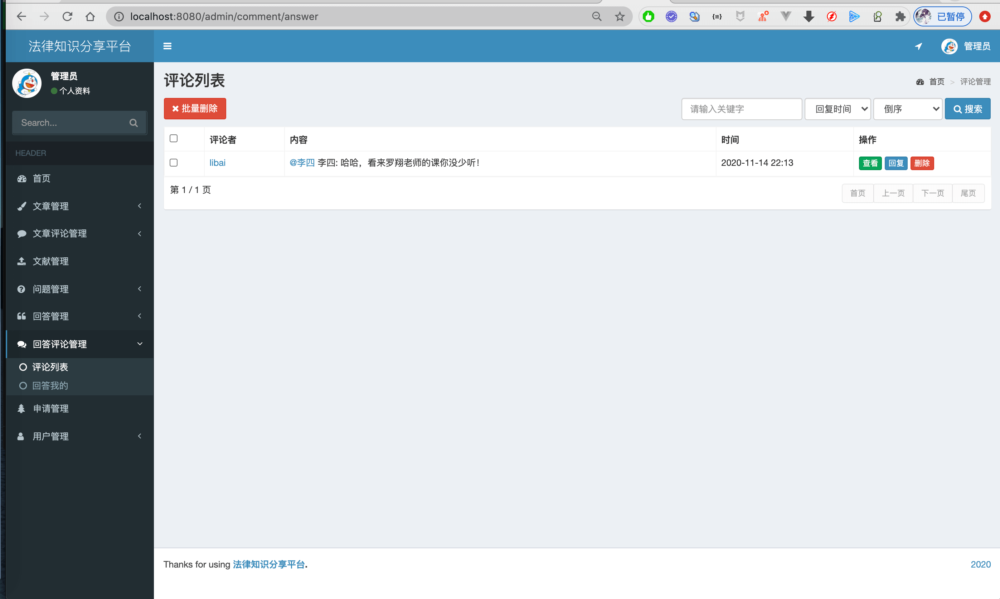

SpringBoot法律知识分享平台，适合做任何类型的问答社区或者论坛。  

可以通过修改网站名称和文章内容，修改成任何类型的论坛。 
详细介绍：[点此](https://liuyanzhao.com/shop/1329450187202105345.html)

## 功能介绍
包含三种角色：管理员、法律专业者、普通用户。 

- 普通用户(默认注册用户)：发布问题、回答、评论文章和回答、点赞问题、收藏问题、用户关注、文献下载、点赞和点踩回答 

- 法律专业者(需要上传文件认证)：比普通用户多发布文章和文章管理功能

- 管理员(所有功能和数据权限)：比法律专业者多法律文献管理、用户认证审核、文章管理、文章分类标签管理、文章评论管理、问题管理、回答管理、回答评论管理、用户管理等功能

## 技术组成
- Springboot
- Myatis
- Thymeleaf
- MySQL
- Maven

## 项目截图

.png)
.png)

.png)
.png)
.png)
.png)

.png)
.png)
.png)
.png)
.png)
.png)
.png)

## 联系方式
目前代码还没有开源，预计明年7月开源，需要的朋友可以联系微信 847064370